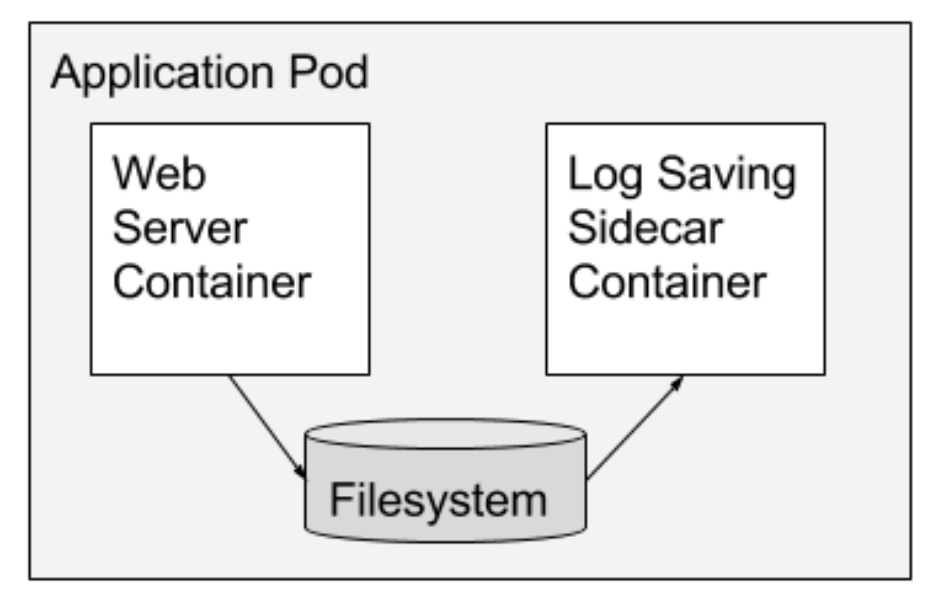
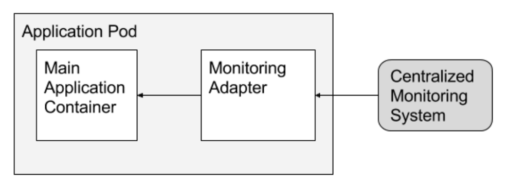

# Certified Kubernetes Application Developer - Recap

## Hints

* Discount-Code: DEVOPS15 (15%)
* Extract yaml from existing Pod: ```kubectl get pod <pod-name> -o yaml > pod-definition.yaml```
* Use the ```kubectl edit pod <pod-name>``` command to edit pod properties.

##  Template

```
apiVersion: 
kind: 
metadata:
spec:
```

## Core Concepts

### Pods

```
apiVersion: v1
kind: Pod
metadata:
  name: <NAME>
  [namespace: <NS>]
  labels:
    <KEY1>: <VALUE1>
    <KEY2>: <VALUE2>
spec:
  containers:
    - name: <NAME>
      image: <IMAGE>
```

### ReplicationController / ReplicaSet

#### ReplicationController

```
apiVersion: v1
kind: ReplicationController
metadata:
  name: <NAME>
  labels:
    <KEY1>: <VALUE1>
    <KEY2>: <VALUE2>
spec:
  template:
    # Pod-Definition
    metadata:
      name: <NAME>
      labels:
        <KEY1>: <VALUE1>
        <KEY2>: <VALUE2>
    spec:
      containers:
        - name: <NAME>
          image: <IMAGE>
  replicas: 3
```

```kubectl get replicationcontroller```

#### ReplicaSet

```
apiVersion: apps/v1
kind: ReplicaSet
metadata:
  name: <NAME>
  labels:
    <KEY1>: <VALUE1>
    <KEY2>: <VALUE2>
spec:
  template:
    ## Pod-Definition
    metadata:
      name: <NAME>
      labels:
        <KEY1>: <VALUE1>
        <KEY2>: <VALUE2>
    spec:
      containers:
        - name: <NAME>
          image: <IMAGE>
  replicas: 3
  selector: 
    matchLabels:
      <KEY1>: <VALUE1>
```

```kubectl get replicaset```

Ways to scale ReplicaSet (assuming yml is updated):
* ```kubectl replace -f ReplicaSet.yml```
* ```kubectl scale --replicas=<NEW_NUMBER_OF_REPLICAS> ReplicaSet.yml```
* ```kubectl scale --replicas=<NEW_NUMBER_OF_REPLICAS> replicaset <NAME>``` (independent of ReplicaSet.yml!)

https://kubernetes.io/docs/concepts/workloads/controllers/replicaset/#when-to-use-a-replicaset

### Deployment

```
apiVersion: apps/v1
kind: Deployment
metadata:
  name: <NAME>
  labels:
    <KEY1>: <VALUE1>
    <KEY2>: <VALUE2>
spec:
  template:
    ## Pod-Definition
    metadata:
      name: <NAME>
      labels:
        <KEY1>: <VALUE1>
        <KEY2>: <VALUE2>
    spec:
      containers:
        - name: <NAME>
          image: <IMAGE>
  replicas: 3
  selector: 
    matchLabels:
      <KEY1>: <VALUE1>
```

### Namespace

```
apiVersion: v1
kind: Namespace
metadata:
  name: <NS>
```

Permanently switch current namespace:

```kubectl config set-context $(kubectl config current-context) --namespace=<NS>```

### DNS

```<SERVICE_NAME>.<NS>.svc.cluster.local```

### ResourceQuota

Used to limit resources in a namespace

```
apiVersion: v1
kind: ResourceQuota
metadata:
  name: <NAME>
  namespace: <NS>
spec:
  hard:
    pods: <NO_OF_PODS>
```

### Certification Tip: Imperative Commands

While you would be working mostly the declarative way - using definition files, imperative commands can help in getting one time tasks done quickly, as well as generate a definition template easily. This would help save a considerable amount of time during your exams.

Before we begin, familiarize with the two options that can come in handy while working with the below commands:

```--dry-run```: By default as soon as the command is run, the resource will be created. If you simply want to test your command, use the ```--dry-run=client``` option. This will not create the resource, instead, tell you whether the resource can be created and if your command is right.

```-o yaml```: This will output the resource definition in YAML format on the screen.

Use the above two in combination to generate a resource definition file quickly, that you can then modify and create resources as required, instead of creating the files from scratch.

Reference:
https://kubernetes.io/docs/reference/generated/kubectl/kubectl-commands

#### POD

Create an NGINX Pod

```kubectl run nginx --image=nginx```

Generate POD Manifest YAML file (```-o yaml```). Don't create it (```--dry-run```)

```kubectl run nginx --image=nginx  --dry-run=client -o yaml```

#### Deployment

Create a deployment

```kubectl create deployment --image=nginx nginx```

Generate Deployment YAML file (```-o yaml```). Don't create it (```--dry-run```)

```kubectl create deployment --image=nginx nginx --dry-run=client -o yaml```

Update image of container in deployment:

```kubectl set image deployment/<DEPLOYMENT_NAME> <OLD_IMAGE_NAME>=<NEW_IMAGE>```

**IMPORTANT**:

```kubectl create deployment``` does not have a ```--replicas``` option. You could first create it and then scale it using the ```kubectl scale deployment <NAME> --replicas=<NEW_NUMBER_OF_REPLICAS>``` command.

Save it to a file - (If you need to modify or add some other details)

```kubectl create deployment --image=nginx nginx --dry-run=client -o yaml > nginx-deployment.yaml```

You can then update the YAML file with the replicas or any other field before creating the deployment.

#### Service

Create a Service named redis-service of type ClusterIP to expose pod redis on port 6379

```kubectl expose pod redis --port=6379 --name redis-service --dry-run=client -o yaml```

(This will automatically use the pod's labels as selectors)

Or

```kubectl create service clusterip redis --tcp=6379:6379 --dry-run=client -o yaml```  (This will not use the pods labels as selectors, instead it will assume selectors as ```app=redis```. You cannot pass in selectors as an option. So it does not work very well if your pod has a different label set. So generate the file and modify the selectors before creating the service)

Create a Service named nginx of type NodePort to expose pod nginx's port 80 on port 30080 on the nodes:

```kubectl expose pod nginx --port=80 --name nginx-service --type=NodePort --dry-run=client -o yaml```

(This will automatically use the pod's labels as selectors, but you cannot specify the node port. You have to generate a definition file and then add the node port in manually before creating the service with the pod.)

Or

```kubectl create service nodeport nginx --tcp=80:80 --node-port=30080 --dry-run=client -o yaml```

(This will not use the pods labels as selectors)

Both the above commands have their own challenges. While one of it cannot accept a selector the other cannot accept a node port. I would recommend going with the `kubectl expose` command. If you need to specify a node port, generate a definition file using the same command and manually input the nodeport before creating the service.

#### Reference:

https://kubernetes.io/docs/reference/kubectl/conventions/

### Certification Tip: Formatting Output with kubectl                                                        

The default output format for all kubectl commands is the human-readable plain-text format.

The -o flag allows us to output the details in several different formats.

**kubectl [command] [TYPE] [NAME] -o <output_format>**

Here are some of the commonly used formats:

1. ```-o json``` Output a JSON formatted API object.

2. ```-o name``` Print only the resource name and nothing else.

3. ```-o wide``` Output in the plain-text format with any additional information.

4. ```-o yaml``` Output a YAML formatted API object.

For more details, refer:* https://kubernetes.io/docs/reference/kubectl/overview/* https://kubernetes.io/docs/reference/kubectl/cheatsheet/

## Configuration

### Docker vs. Kubernetes-Commands

#### Docker

Dockerfile for ubuntu-container that sleeps on default for 5 seconds

```
FROM ubuntu
ENTRYPOINT ["sleep"]
CMD ["5"]
```

to overwrite the default, use

```docker run <IMAGE> 10```

to overwrite entrypoint, use

```docker run --entrypoint <OTHER_ENTRYPOINT> <IMAGE>```

#### Move to Kubernetes

```
apiVersion: v1
kind: Pod
metadata:
  name: <NAME>
spec:
  containers:
    - name: <NAME>
      image: <IMAGE>
      command: ["corresponds to entrypoint"]
      args: ["corresponds to cmd"]
```

### Editing Pods and Deployments

A quick note on editing PODs and Deployments

#### Edit a POD

Remember, you CANNOT edit specifications of an existing POD other than the below.* spec.containers[*].image* spec.initContainers[*].image* spec.activeDeadlineSeconds* spec.tolerations

For example you cannot edit the environment variables, service accounts, resource limits (all of which we will discuss later) of a running pod. But if you really want to, you have 2 options:

1. Run the ```kubectl edit pod <pod name>``` command.  This will open the pod specification in an editor (vi editor). Then edit the required properties. When you try to save it, you will be denied. This is because you are attempting to edit a field on the pod that is not editable.

A copy of the file with your changes is saved in a temporary location as shown above.

You can then delete the existing pod by running the command:

```kubectl delete pod webapp```

Then create a new pod with your changes using the temporary file

```kubectl create -f /tmp/kubectl-edit-ccvrq.yaml```

2. The second option is to extract the pod definition in YAML format to a file using the command

```kubectl get pod webapp -o yaml > my-new-pod.yaml```

Then make the changes to the exported file using an editor (vi editor). Save the changes

```vi my-new-pod.yaml```

Then delete the existing pod

```kubectl delete pod webapp```

Then create a new pod with the edited file

```kubectl create -f my-new-pod.yaml```

#### Edit Deployments

With Deployments you can easily edit any field/property of the POD template. Since the pod template is a child of the deployment specification,  with every change the deployment will automatically delete and create a new pod with the new changes. So if you are asked to edit a property of a POD part of a deployment you may do that simply by running the command

```kubectl edit deployment my-deployment```

### ConfigMaps

#### Declaring

The imperative way:

```kubectl create configmap <config-name> --from-literal=<KEY1>=<VALUE1> --from-literal=<KEY2>=<VALUE2>```

The imperative way from configuration-file:

```kubectl create configmap <config-name> --from-file=<path-to-config-file>```

The declarative way:

```
apiVersion: v1
kind: ConfigMap
metadata:
  name: <NAME>
data:
    <KEY1>: <VALUE1>
    <KEY2>: <VALUE2>
```

#### Injecting

Inject the whole ConfigMap as environment variables into Pod:

```
apiVersion: v1
kind: Pod
metadata:
  name: <NAME>
  [namespace: <NS>]
  labels:
    <KEY1>: <VALUE1>
    <KEY2>: <VALUE2>
spec:
  containers:
    - name: <NAME>
      image: <IMAGE>
      envFrom:
      - configMapRef:
          name: <CM_NAME>
```

Inject single ConfigMap-value as environment variable into Pod:

```
apiVersion: v1
kind: Pod
metadata:
  name: <NAME>
  [namespace: <NS>]
  labels:
    <KEY1>: <VALUE1>
    <KEY2>: <VALUE2>
spec:
  containers:
    - name: <NAME>
      image: <IMAGE>
      env:
        - configMapKeyRef:
            name: <CM_NAME>
            key: <KEY>
```

Inject by volume (creates file for each configMap-pair - name is the key, content is the value - into the volume):

```
apiVersion: v1
kind: Pod
metadata:
  name: <NAME>
  [namespace: <NS>]
  labels:
    <KEY1>: <VALUE1>
    <KEY2>: <VALUE2>
spec:
  containers:
    - name: <NAME>
      image: <IMAGE>
  volumes:
    - name: <VOL_NAME>
      configMap:
        name: <CM_NAME>
```

### Secret

#### Declaring

The imperative way:

```kubectl create secret generic <secret-name> --from-literal=<KEY1>=<VALUE1> --from-literal=<KEY2>=<VALUE2>```

The imperative way from secret-file:

```kubectl create secret generic <secret-name> --from-file=<path-to-secret-file>```

When creating secrets the declarative way, one has to provide the base64-encoded values, this can be achieved by

```echo -n '<VALUE>' | base64```

```
apiVersion: v1
kind: Secret
metadata:
  name: <NAME>
data:
    <KEY1>: <BASE64_VALUE1>
    <KEY2>: <BASE64_VALUE2>
```

To read the secrets, use

```kubectl get secret <secret-name> -o yaml```

this shows the base64-encoded values, to decode them, use

```echo -n <base64-value> | base64 --decode```

#### Injecting

Inject the whole Secret as environment variables into Pod:

```
apiVersion: v1
kind: Pod
metadata:
  name: <NAME>
  [namespace: <NS>]
  labels:
    <KEY1>: <VALUE1>
    <KEY2>: <VALUE2>
spec:
  containers:
    - name: <NAME>
      image: <IMAGE>
      envFrom:
      - secretRef:
          name: <SECRET_NAME>
```

Inject single Secret-value as environment variable into Pod:

```
apiVersion: v1
kind: Pod
metadata:
  name: <NAME>
  [namespace: <NS>]
  labels:
    <KEY1>: <VALUE1>
    <KEY2>: <VALUE2>
spec:
  containers:
    - name: <NAME>
      image: <IMAGE>
      env:
        - secretKeyRef:
            name: <SECRET_NAME>
            key: <KEY>
```

Inject by volume (creates file for each secret-pair - name is the key, content is the value - into the volume):

```
apiVersion: v1
kind: Pod
metadata:
  name: <NAME>
  [namespace: <NS>]
  labels:
    <KEY1>: <VALUE1>
    <KEY2>: <VALUE2>
spec:
  containers:
    - name: <NAME>
      image: <IMAGE>
  volumes:
    - name: <VOL_NAME>
      secret:
        name: <SECRET_NAME>
```

#### A quick note about Secrets!

Remember that secrets encode data in base64 format. Anyone with the base64 encoded secret can easily decode it. As such the secrets can be considered as not very safe.

The concept of safety of the Secrets is a bit confusing in Kubernetes. The [kubernetes documentation](https://kubernetes.io/docs/concepts/configuration/secret/) page and a lot of blogs out there refer to secrets as a "safer option" to store sensitive data. They are safer than storing in plain text as they reduce the risk of accidentally exposing passwords and other sensitive data. In my opinion it's not the secret itself that is safe, it is the practices around it. 

Secrets are not encrypted, so it is not safer in that sense. However, some best practices around using secrets make it safer. As in best practices like:* Not checking-in secret object definition files to source code repositories.* [Enabling Encryption at Rest](https://kubernetes.io/docs/tasks/administer-cluster/encrypt-data/) for Secrets so they are stored encrypted in ETCD. 

Also the way kubernetes handles secrets. Such as:

A secret is only sent to a node if a pod on that node requires it.

Kubelet stores the secret into a tmpfs so that the secret is not written to disk storage.

Once the Pod that depends on the secret is deleted, kubelet will delete its local copy of the secret data as well.

Read about the [protections](https://kubernetes.io/docs/concepts/configuration/secret/#protections) and [risks](https://kubernetes.io/docs/concepts/configuration/secret/#risks) of using secrets.

Having said that, there are other better ways of handling sensitive data like passwords in Kubernetes, such as using tools like Helm Secrets, [HashiCorp Vault](https://www.vaultproject.io). 

### Security Contexts

#### Docker

Runs per default as root-User, to specify a certain user-id, use

```docker run <XY> --user <ID>```

You may define it in the Dockerfile

```
...
USER <ID>
...
```

To view the capabilities, view

/usr/include/linux/capability.h

To add a certain capability to the container, use

```docker run <XY> --cap-add <CAPABILITY>```

To remove a certain capability to the container, use

```docker run <XY> --cap-drop <CAPABILITY>```

To run a container with all capabilities, use

```docker run <XY> --privileged```

#### Kubernetes

Pod-Level SecurityContext

```
apiVersion: v1
kind: Pod
metadata:
  name: <NAME>
spec:
  securityContext:
    runAsUser: <UID>
  containers:
    - name: <NAME>
      image: <IMAGE>
```

Container-Level SecurityContext (capabilities are only supported on container-level)

```
apiVersion: v1
kind: Pod
metadata:
  name: <NAME>
spec:
  containers:
    - name: <NAME>
      image: <IMAGE>
      securityContext:
        runAsUser: <UID>
        capabilities:
          add: [<CAPABILITIES>]
```

Container-level security overrides pod-level security

### ServiceAccounts

Imperative:

```kubectl create serviceaccount <SA_NAME>```

with creating a ServiceAccount a Token will be created, which can be used to authenticate. The token itself will be stored as a secret. The token can be used as Bearer-Token.

For every namespace there is a ServiceAccount ```default```, which will be auto-mounted to every Pod within the namespace. This ServiceAccount is very restricted and only has access to basic Kubernetes-queries.

Declarative:

```
apiVersion: v1
kind: ServiceAccount
metadata:
  name: <SA_NAME>
```

Specify ServiceAccount within Pod:

```
apiVersion: v1
kind: Pod
metadata:
  name: <NAME>
spec:
  containers:
    - name: <NAME>
      image: <IMAGE>
  serviceAccount: <SA_NAME>
```

To prevent auto-mounting:

```
apiVersion: v1
kind: Pod
metadata:
  name: <NAME>
spec:
  containers:
    - name: <NAME>
      image: <IMAGE>
  automountServiceAccountToken: false
```

### Resource Requirements

Default Resource-Requirement for a Pod or a container within a Pod:
* 0.5 CPU
* 256 Mi (Mebibyte) Memory

To specify sufficient resources:

```
apiVersion: v1
kind: Pod
metadata:
  name: <NAME>
spec:
  containers:
    - name: <NAME>
      image: <IMAGE>
      resources: 
        requests:
          memory: "1Gi"
          cpu: 1
```

#### Memory

* 1 G (Gigabyte) = 1.000.000.000 bytes
* 1 M (Megabyte) = 1.000.000 bytes
* 1 K (Kilobyte) = 1.000 bytes
* 1 Gi (Gibibyte) = 1.073.741.824 bytes
* 1 Mi (Mebibyte) = 1.048.576 bytes
* 1 Ki (Kibibyte) = 1.024 bytes

#### Resource Limits

```
apiVersion: v1
kind: Pod
metadata:
  name: <NAME>
spec:
  containers:
    - name: <NAME>
      image: <IMAGE>
      resources: 
        requests:
          memory: "1Gi"
          cpu: 1
        limits:
          memory: "2Gi"
          cpu: 2
```

#### Exceed Limits
* CPU will be throttled, so that it will not go beyond the specified limit
* Container can consume more Memory then specified, if it tries constantly, it will be terminated

#### Note on default resource requirements and limits

In the previous lecture, I said - "When a pod is created the containers are assigned a default CPU request of .5 and memory of 256Mi". For the POD to pick up those defaults you must have first set those as default values for request and limit by creating a LimitRange in that namespace.

```
apiVersion: v1
kind: LimitRange
metadata:
  name: mem-limit-range
spec:
  limits:
  - default:
      memory: 512Mi
    defaultRequest:
      memory: 256Mi
    type: Container
```

https://kubernetes.io/docs/tasks/administer-cluster/manage-resources/memory-default-namespace/

```
apiVersion: v1
kind: LimitRange
metadata:
  name: cpu-limit-range
spec:
  limits:
  - default:
      cpu: 1
    defaultRequest:
      cpu: 0.5
    type: Container
```

https://kubernetes.io/docs/tasks/administer-cluster/manage-resources/cpu-default-namespace/

**References**

https://kubernetes.io/docs/tasks/configure-pod-container/assign-memory-resource

### Taints & Tolerations

"What Pods can be scheduled on a node?"

Taint a node, so that only tolerant pods can be placed.

To taint a node:

```kubectl taint nodes <NODE_NAME> key=value:taint-effect```

What happens to pods that do not tolerate this taint? Supported taint-effects:* NoSchedule: pods will not be scheduled* PreferNoSchedule: System will try to avoid placing pod on the node* NoExecute: new pods will not be scheduled on the pod and existing pods on the node will be evicted if they do not tolerate the taint

To apply toleration to pod:

```
apiVersion: v1
kind: Pod
metadata:
  name: <NAME>
spec:
  containers:
    - name: <NAME>
      image: <IMAGE>
  tolerations:
  - key: "key"
    operator: "Equal"
    value: "value"
    effect: "taint-effect"
```

To lookup taints:

```kubectl describe node <NODE_NAME> | grep Taint```

### Node Selectors

Label a node:

```kubectl label nodes <node-name> <label-key>=<label-value>```

Select node:

```
apiVersion: v1
kind: Pod
metadata:
  name: <NAME>
spec:
  containers:
    - name: <NAME>
      image: <IMAGE>
  nodeSelector:
    <label-key>: <label-value>
```

#### Limitations

Selector only as key-value-pair, it is not possible, to query "NOT"- or "OR"-statements

### Node Affinity

To achieve the same as the example in Node Selectors:

```
apiVersion: v1
kind: Pod
metadata:
  name: <NAME>
spec:
  containers:
    - name: <NAME>
      image: <IMAGE>
  affinity:
    nodeAffinity:
      requiredDuringSchedulingIgnoredDuringExecution:
        nodeSelectorTerms:
        - matchExpressions:
          - key: <label-key>
            operator: In
            values:
            - <label-value>
    <label-key>: <label-value>
```

#### Affinity Types

**Available**
* requiredDuringSchedulingIgnoredDuringExecution
* preferredDuringSchedulingIgnoredDuringExecution

**Planned**
* requiredDuringSchedulingRequiredDuringExecution

## Certification Tips:
* https://www.linkedin.com/pulse/my-ckad-exam-experience-atharva-chauthaiwale/
* https://medium.com/@harioverhere/ckad-certified-kubernetes-application-developer-my-journey-3afb0901014
* https://github.com/lucassha/CKAD-resources

## Multi-Container Pods

### Sidecar containers

Sidecar containers extend and enhance the "main" container, they take existing containers and make them better.  As an example, consider a container that runs the Nginx web server.  Add a different container that syncs the file system with a git repository, share the file system between the containers and you have built Git push-to-deploy.  But you’ve done it in a modular manner where the git synchronizer can be built by a different team, and can be reused across many different web servers (Apache, Python, Tomcat, etc).  Because of this modularity, you only have to write and test your git synchronizer once and reuse it across numerous apps. And if someone else writes it, you don’t even need to do that.



### Ambassador containers

Ambassador containers proxy a local connection to the world.  As an example, consider a Redis cluster with read-replicas and a single write master.  You can create a Pod that groups your main application with a Redis ambassador container.  The ambassador is a proxy is responsible for splitting reads and writes and sending them on to the appropriate servers.  Because these two containers share a network namespace, they share an IP address and your application can open a connection on “localhost” and find the proxy without any service discovery.  As far as your main application is concerned, it is simply connecting to a Redis server on localhost.  This is powerful, not just because of separation of concerns and the fact that different teams can easily own the components, but also because in the development environment, you can simply skip the proxy and connect directly to a Redis server that is running on localhost.


### Adapter containers

Adapter containers standardize and normalize output.  Consider the task of monitoring N different applications.  Each application may be built with a different way of exporting monitoring data. (e.g. JMX, StatsD, application specific statistics) but every monitoring system expects a consistent and uniform data model for the monitoring data it collects.  By using the adapter pattern of composite containers, you can transform the heterogeneous monitoring data from different systems into a single unified representation by creating Pods that groups the application containers with adapters that know how to do the transformation.  Again because these Pods share namespaces and file systems, the coordination of these two containers is simple and straightforward.



## Observability

### Pod Status

* Pending: Kubernetes is looking for node to place the pod* ContainerCreating: pod is placed on a node, images are pulled and the container starts, but is not running yet
* Running: once all the containers in a pod are started, where it continues to be, until the programm completes successfully, or is terminated

### Pod Conditions
* PodScheduled
* Initialized
* ContainersReady
* Ready: 

The Pod conditions can be retrieved via

```kubectl describe pod <POD_NAME>```

where it will be placed in the ```Conditions```-section.

The "ready"-condition however does not indicate, that the application running in the container is actually ready (e.g. application takes a certain time to "warm-up").

### Readiness Probes

Types of readinessprobes:* httpGet: 

```
apiVersion: v1
kind: Pod
metadata:
  name: <NAME>
spec:
  containers:
    - name: <NAME>
      image: <IMAGE>
      ports:
        - containerPort: 8080
      readinessProbe:
        httpGet:
          path: /api/ready
          port: 8080
```

* tcpSocket:

```
apiVersion: v1
kind: Pod
metadata:
  name: <NAME>
spec:
  containers:
    - name: <NAME>
      image: <IMAGE>
      ports:
        - containerPort: 8080
      readinessProbe:
        tcpSocket:
          port: 3306
```

* exec:

```
apiVersion: v1
kind: Pod
metadata:
  name: <NAME>
spec:
  containers:
    - name: <NAME>
      image: <IMAGE>
      ports:
        - containerPort: 8080
      readinessProbe:
        exec:
          command:
            - cat
            - /app/is_ready
```

Additional Parameters:* initialDelaySeconds* periodSeconds* failureThreshold (by default Kubernetes attempts to start the container 3 times)

### Liveness Probes

Indicates, whether a running container is able to serve its porpuse (detects frozen state).

Definition same as ReadinessProbe. 

### Container Logging

To view logs:

```kubectl logs <POD_NAME>```

For live-logging

```kubectl logs -f <POD_NAME>```

If there are multiple containers running in the pod, you must explicitly provide the container-name:

```kubectl logs <POD_NAME> <CONTAINER_NAME>```

### Monitor and Debug Applications

Install metrics-server, see 

https://github.com/kubernetes-sigs/metrics-server

Get node-metrics:

```kubectl top node```

Get pod-metrics:

```kubectl top pod```

## Pod Design

### Labels, Selectors and Annotations

Labels & Selectors are a standard way to group and filter resources.

Labels are properties attached to each item. Selectors help filter these items.

Select in kubectl:

```kubectl get pod --selector <label1-key>=<label1-value>,<label2-key>=<label2-value>```

### Rolling Updates & Rollbacks in Deployments

Get Rollout status:

```kubectl rollout status deployment/<DEPLOYMENT_NAME>```

Get revisions and history of deployment:

```kubectl rollout history deployment/<DEPLOYMENT_NAME>```

Deployment-Strategies:* RollingUpdate: The Deployment updates Pods in a rolling update fashion (default-strategy)* Recreate: All existing Pods are killed before new ones are created

To rollback to the previous version:

```kubectl rollout undo deployment/<DEPLOYMENT_NAME>```

### Updating a deployment

Here are some handy examples related to updating a Kubernetes Deployment:* Creating a deployment, checking the rollout status and history:

In the example below, we will first create a simple deployment and inspect the rollout status and the rollout history:

```
master $ kubectl create deployment nginx --image=nginx:1.16
deployment.apps/nginx created

master $ kubectl rollout status deployment nginx
Waiting for deployment "nginx" rollout to finish: 0 of 1 updated replicas are available...
deployment "nginx" successfully rolled out

master $ kubectl rollout history deployment nginx
deployment.extensions/nginx

REVISION CHANGE-CAUSE
1     <none>
```

* Using the ```--revision``` flag:

Here the revision 1 is the first version where the deployment was created.

You can check the status of each revision individually by using the --revision flag:

```
master $ kubectl rollout history deployment nginx --revision=1
deployment.extensions/nginx with revision #1

Pod Template:
 Labels:    app=nginx    pod-template-hash=6454457cdb
 Containers:  nginx:  Image:   nginx:1.16
  Port:    <none>
  Host Port: <none>
  Environment:    <none>
  Mounts:   <none>
 Volumes:   <none>
```

* Using the ```--record``` flag:

You would have noticed that the "change-cause" field is empty in the rollout history output. We can use the --record flag to save the command used to create/update a deployment against the revision number.

```
master $ kubectl set image deployment nginx nginx=nginx:1.17 --record
deployment.extensions/nginx image updated

master $ kubectl rollout history deployment nginx
deployment.extensions/nginx

REVISION CHANGE-CAUSE
1     <none>
2     kubectl set image deployment nginx nginx=nginx:1.17 --record=true
```

You can now see that the change-cause is recorded for the revision 2 of this deployment.

Let's make some more changes. In the example below, we are editing the deployment and changing the image from nginx:1.17 to nginx:latest while making use of the --record flag.

```
master $ kubectl edit deployments. nginx --record
deployment.extensions/nginx edited

master $ kubectl rollout history deployment nginx

REVISION CHANGE-CAUSE
1     <none>
2     kubectl set image deployment nginx nginx=nginx:1.17 --record=true
3     kubectl edit deployments. nginx --record=true

master $ kubectl rollout history deployment nginx --revision=3
deployment.extensions/nginx with revision #3
Pod Template: Labels:    app=nginx
    pod-template-hash=df6487dc Annotations: kubernetes.io/change-cause: kubectl edit deployments. nginx --record=true
 Containers:
  nginx:
  Image:   nginx:latest
  Port:    <none>
  Host Port: <none>
  Environment:    <none>
  Mounts:   <none>
 Volumes:   <none>
```

* Undo a change:

Lets now rollback to the previous revision:

```
master $ kubectl rollout undo deployment nginx deployment.extensions/nginx rolled back

master $ kubectl rollout history deployment nginx deployment.extensions/nginxREVISION CHANGE-CAUSE
1     <none>
3     kubectl edit deployments. nginx --record=true
4     kubectl set image deployment nginx nginx=nginx:1.17 --record=true

master $ kubectl rollout history deployment nginx --revision=4
deployment.extensions/nginx with revision #4Pod Template:
 Labels:    app=nginx    pod-template-hash=b99b98f9
 Annotations: kubernetes.io/change-cause: kubectl set image deployment nginx nginx=nginx:1.17 --record=true
 Containers:
  nginx:
  Image:   nginx:1.17
  Port:    <none>
  Host Port: <none>
  Environment:    <none>
  Mounts:   <none>
 Volumes:   <none>

master $ kubectl describe deployments. nginx | grep -i image:
  Image:    nginx:1.17
```

With this, we have rolled back to the previous version of the deployment with the image = nginx:1.17.

### Jobs

RestartPolicy, default: Always

Kubernetes tries to restart container until in remains running (so it does not support short lasting executions).

RestartPolicies:
* Always (default): always recreates container, when it exits* Never* OnFailure

ReplicaSet (running at all times) vs. Jobs (for completion)

```
apiVersion: batch/v1
kind: Job
metadata:
  name: add
spec:
  completions: <NO_OF_PODS>
  parallelism: <NO_OF_PARALLEL_PODS>
  template:
    spec:
      containers:
      - name: add
        image: ubuntu
        command: ["expr",  "3", "+", "2"]
      restartPolicy: Never
```

Each pod is created, after the other is completed. If a pod fails, the job will create pods until the ```completions``` are satisfied.

view jobs:

```kubectl get jobs```

view corresponding pods:

```kubectl get pods```

view output:

```kubectl logs <POD_NAME>```

Deleting the job will also delete the pods

Pod backoff failure policy

There are situations where you want to fail a Job after some amount of retries due to a logical error in configuration etc. To do so, set .spec.backoffLimit to specify the number of retries before considering a Job as failed. The back-off limit is set by default to 6. Failed Pods associated with the Job are recreated by the Job controller with an exponential back-off delay (10s, 20s, 40s ...) capped at six minutes. The back-off count is reset when a Job's Pod is deleted or successful without any other Pods for the Job failing around that time.

Note: If your job has restartPolicy = "OnFailure", keep in mind that your container running the Job will be terminated once the job backoff limit has been reached. This can make debugging the Job's executable more difficult. We suggest setting restartPolicy = "Never" when debugging the Job or using a logging system to ensure output from failed Jobs is not lost inadvertently.

### CronJobs

Jobs running periodically.

```
apiVersion: batch/v1beta1
kind: CronJob
metadata:
  name: cron-add
spec:
  schedule: "*/1 * * * *"
  jobTemplate:
    spec:
      template:
        spec:
          containers:
          - name: add
            image: ubuntu
            command: ["expr",  "3", "+", "2"]
          restartPolicy: OnFailure
```

view jobs:

```kubectl get cronjobs```

## Services & Networking

### Services

Services enables communication between various components within and outside of the application, helps connect applications together with other applications or users. 

An abstract way to expose an application running on a set of Pods as a network service.

Types of Services:
* ClusterIP: Exposes the Service on a cluster-internal IP. Choosing this value makes the Service only reachable from within the cluster. This is the default ServiceType.
```
apiVersion: v1
kind: Service
metadata:
  name: <SERVICE_NAME>
spec:
  selector:
    <label-key>: <label-value>
  type: ClusterIP
  ports:
    - port: 80 # Port inside the service, mandatory
      targetPort: 80 # Port inside the pod, can be left out, if its the same as port
```

* NodePort: Exposes the Service on each Node's IP at a static port (the NodePort). A ClusterIP Service, to which the NodePort Service routes, is automatically created. You'll be able to contact the NodePort Service, from outside the cluster, by requesting ```<NodeIP>:<NodePort>```.


```
apiVersion: v1
kind: Service
metadata:
  name: <SERVICE_NAME>
spec:
  selector:
    <label-key>: <label-value>
  type: NodePort
  ports:
    - port: 80 # Port inside the service, mandatory
      targetPort: 80 # Port inside the pod, can be left out, if its the same as port
      nodePort: 30080 # Port where the service will be exposed to (range 30000 to 32767)
```

* LoadBalancer: Exposes the Service externally using a cloud provider's load balancer. NodePort and ClusterIP Services, to which the external load balancer routes, are automatically created.* ExternalName: Maps the Service to the contents of the externalName field (e.g. foo.bar.example.com), by returning a CNAME record with its value. No proxying of any kind is set up.

### Ingress Networking

Ingress exposes HTTP and HTTPS routes from outside the cluster to services within the cluster. Traffic routing is controlled by rules defined on the Ingress resource.

```
apiVersion: extensions/v1beta1
kind: Ingress
metadata:
  name: <NAME>
spec:
  backend: #used to route to service and not pod directly
    serviceName: <NAME>
    servicePort: <PORT>
```

```kubectl get ingress```

If you want to route traffic based on different conditions (e.g. one rule for traffic originating from each domain or hostname):

```
apiVersion: extensions/v1beta1
kind: Ingress
metadata:
  name: <NAME>
spec:
  defaultBackend:
    serviceName: <NAME0>
    servicePort: <PORT0>
  rules:
    - host: "foo.bar.com"
      http:
        paths:
        - pathType: Prefix
          path: "/bar"
          backend:
            serviceName: <NAME1>
            servicePort: <PORT1>
    - host: "*.foo.com"
      http:
        paths:
        - pathType: Prefix
          path: "/foo"
          backend:
            serviceName: <NAME2>
            servicePort: <PORT2>
```

Requests, not matching any rule, will be redirected to the last configured rule (if no defaultBackend is configured).

### Rewrite-Target-Option

Different ingress controllers have different options that can be used to customise the way it works. NGINX Ingress controller has many options that can be seen [here](https://kubernetes.github.io/ingress-nginx/examples/). I would like to explain one such option that we will use in our labs. The Rewrite target option.

Our ```watch``` app displays the video streaming webpage at ```http://<watch-service>:<port>/```

Our ```wear``` app displays the apparel webpage at ```http://<wear-service>:<port>/```

We must configure Ingress to achieve the below. When user visits the URL on the left, his request should be forwarded internally to the URL on the right. Note that the /watch and /wear URL path are what we configure on the ingress controller so we can forwarded users to the appropriate application in the backend. The applications don't have this URL/Path configured on them:* ```http://<ingress-service>:<ingress-port>/watch``` --> ```http://<watch-service>:<port>/```

* ```http://<ingress-service>:<ingress-port>/wear``` --> ```http://<wear-service>:<port>/```

Without the ```rewrite-target``` option, this is what would happen:* ```http://<ingress-service>:<ingress-port>/watch``` --> ```http://<watch-service>:<port>/watch```

* ```http://<ingress-service>:<ingress-port>/wear``` --> ```http://<wear-service>:<port>/wear```

Notice ```watch``` and ```wear``` at the end of the target URLs. The target applications are not configured with ```/watch``` or ```/wear``` paths. They are different applications built specifically for their purpose, so they don't expect /watch or /wear in the URLs. And as such the requests would fail and throw a ```404``` not found error.

To fix that we want to "ReWrite" the URL when the request is passed on to the watch or wear applications. We don't want to pass in the same path that user typed in. So we specify the ```rewrite-target``` option. This rewrites the URL by replacing whatever is under ```rules->http->paths->path``` which happens to be ```/pay``` in this case with the value in ```rewrite-target```. This works just like a search and replace function.

For example: ```replace(path, rewrite-target)```

In our case: ```replace("/path","/")```

```
apiVersion: extensions/v1beta1
kind: Ingress
metadata:
  name: test-ingress
  namespace: critical-space
  annotations:
    nginx.ingress.kubernetes.io/rewrite-target: /
spec:
  rules:
  - http:
      paths:
      - path: /pay
        backend:
          serviceName: pay-service
          servicePort: 8282
```

In another example given here, this could also be:

```replace("/something(/|$)(.*)", "/$2")```

```
apiVersion: extensions/v1beta1
kind: Ingress
metadata:
  annotations:
    nginx.ingress.kubernetes.io/rewrite-target: /$2
  name: rewrite
  namespace: default
spec:
  rules:
  - host: rewrite.bar.com
    http:
      paths:
      - backend:
          serviceName: http-svc
          servicePort: 80
        path: /something(/|$)(.*)
```

### Network Policies

NetworkPolicies are an application-centric construct which allow you to specify how a pod is allowed to communicate with various network "entities" over the network.

The entities that a Pod can communicate with are identified through a combination of the following 3 identifiers:

* Other pods that are allowed (exception: a pod cannot block access to itself)
* Namespaces that are allowed
* IP blocks (exception: traffic to and from the node where a Pod is running is always allowed, regardless of the IP address of the Pod or the node)

```
apiVersion: networking.k8s.io/v1
kind: NetworkPolicy
metadata:
  name: test-network-policy
  namespace: default
spec:
  podSelector:
    matchLabels:
      role: db
  policyTypes:
  - Ingress
  - Egress
  ingress:
  - from:
    - ipBlock:
        cidr: 172.17.0.0/16
        except:
        - 172.17.1.0/24
    - namespaceSelector:
        matchLabels:
          project: myproject
    - podSelector:
        matchLabels:
          role: frontend
    ports:
    - protocol: TCP
      port: 6379
  egress:
  - to:
    - ipBlock:
        cidr: 10.0.0.0/24
    ports:
    - protocol: TCP
      port: 5978
```

* **spec:** NetworkPolicy [spec](https://github.com/kubernetes/community/blob/master/contributors/devel/sig-architecture/api-conventions.md#spec-and-status) has all the information needed to define a particular network policy in the given namespace.

* **podSelector:** Each NetworkPolicy includes a podSelector which selects the grouping of pods to which the policy applies. The example policy selects pods with the label "role=db". An empty podSelector selects all pods in the namespace.

* **policyTypes:** Each NetworkPolicy includes a policyTypes list which may include either Ingress, Egress, or both. The policyTypes field indicates whether or not the given policy applies to ingress traffic to selected pod, egress traffic from selected pods, or both. If no policyTypes are specified on a NetworkPolicy then by default Ingress will always be set and Egress will be set if the NetworkPolicy has any egress rules.

* **ingress:** Each NetworkPolicy may include a list of allowed ingress rules. Each rule allows traffic which matches both the from and ports sections. The example policy contains a single rule, which matches traffic on a single port, from one of three sources, the first specified via an ipBlock, the second via a namespaceSelector and the third via a podSelector.

* **egress:** Each NetworkPolicy may include a list of allowed egress rules. Each rule allows traffic which matches both the to and ports sections. The example policy contains a single rule, which matches traffic on a single port to any destination in 10.0.0.0/24.

So, the example NetworkPolicy:

* isolates "role=db" pods in the "default" namespace for both ingress and egress traffic (if they weren't already isolated)

* (Ingress rules) allows connections to all pods in the "default" namespace with the label "role=db" on TCP port 6379 from:

  * any pod in the "default" namespace with the label "role=frontend"
  * any pod in a namespace with the label "project=myproject"
  * IP addresses in the ranges 172.17.0.0–172.17.0.255 and 172.17.2.0–172.17.255.255 (ie, all of 172.17.0.0/16 except 172.17.1.0/24)
* (Egress rules) allows connections from any pod in the "default" namespace with the label "role=db" to CIDR 10.0.0.0/24 on TCP port 5978

```kubectl get netpol <NAME>```

## State Persistence

### Volumes

Pods are transient in nature (meaning: data will be destroyed alongside the pod). 

https://kubernetes.io/docs/concepts/storage/volumes/

E.g. for writing data to a node-directory

```
apiVersion: v1
kind: Pod
metadata:
  name: test-pd
spec:
  containers:
  - image: k8s.gcr.io/test-webserver
    name: test-container
    volumeMounts:
    - mountPath: /opt
      name: data-volume
  volumes:
  - name: data-volume
    hostPath: 
      path: /data
      type: Directory
```

### Persistent Volumes

A persistent volume is a cluster wide pool of storage volumes configured by an administrator to be used by users deploying applications on the cluster. The users can now select storage from this pool using Persistent Volume claims.

```
apiVersion: v1
kind: PersistentVolume
metadata:
  name: pv0003
spec:
  capacity:
    storage: 5Gi
  accessModes:
    - ReadWriteOnce
  hostPath: 
    path: /data
```

The access modes are:

* ReadWriteOnce -- the volume can be mounted as read-write by a single node
* ReadOnlyMany -- the volume can be mounted read-only by many nodes
* ReadWriteMany -- the volume can be mounted as read-write by many nodes

### Persistent Volume Claims

Once the Persistent Volume Claims are created. Kubernetes binds the Persistent Volumes to Claims based on the request and properties set on the volume. Every Persistent Volume Claim is bound to a single Persistent Volume during the binding process. Kubernetes tries to find a Persistent Volume that has sufficient capacity as requested by the claim. And any other request properties such as Access Modes, Volume Modes, Storage Class, etc..  
However, if there are multiple possible matches for a single claim and you would like to specifically use a particular volume, you could still use labels and selectors to bind to the right volumes.
Note that a smaller claim may get bound to a larger volume if all the other criteria matches and there are no better options. There is a one-to-one relationship between Claims and Volumes, so no other claims can utilize the remaining capacity in the volume.

```
apiVersion: v1
kind: PersistentVolumeClaim
metadata:
  name: myclaim
spec:
  accessModes:
    - ReadWriteOnce
  resources:
    requests:
      storage: 8Gi
```

But what happens to the underlying persistent volume when the claim is deleted? You can choose what is to happen to the volume. By default it is set to retain, meaning the persistent volume will remain until it is manually deleted by the administrator, it is not available for reuse by any other claims (```persistantVolumeReclaimPolicy: Retain```) or it can be deleted automatically (```persistantVolumeReclaimPolicy: Delete```). The third option is to recycle the persistent volume, where the data in the data volume will be scrubbed before making it available to other claims. (```persistantVolumeReclaimPolicy: Recycle```)

### Using PVCs in PODs

Once you create a PVC use it in a POD definition file by specifying the PVC Claim name under persistentVolumeClaim section in the volumes section like this:

```
apiVersion: v1
kind: Pod
metadata:
  name: mypod
spec:
  containers:
    - name: myfrontend
      image: nginx
      volumeMounts:
      - mountPath: "/var/www/html"
        name: mypd
  volumes:
    - name: mypd
      persistentVolumeClaim:
        claimName: myclaim
```

The same is true for ReplicaSets or Deployments. Add this to the pod template section of a Deployment on ReplicaSet.

Reference URL: https://kubernetes.io/docs/concepts/storage/persistent-volumes/#claims-as-volumes

### Storage Classes

#### Static Provisioning

Before you create a PV for lets say Azure Disk, you have to create the Azure Disk on Azure. Every time an application requires storage, you have to first manually provision the Disk on Azure and then create a PV using the same name.

#### Dynamic Provisioning

It would be nice if the volume gets provisioned automatically when the application requires it.

```
apiVersion: storage.k8s.io/v1
kind: StorageClass
metadata:
  name: slow
provisioner: kubernetes.io/azure-disk
parameters:
  skuName: Standard_LRS
  location: eastus
  storageAccount: azure_storage_account_name
```

The PV-Definition will no longer be required because the PV and any associated storage is going to be created automatically when the storage class is created for the PVC to use the storage class we defined, we specify the storage class name in the PVC-definition.

```
apiVersion: v1
kind: PersistentVolumeClaim
metadata:
  name: myclaim
spec:
  accessModes:
    - ReadWriteOnce
  volumeMode: Filesystem
  resources:
    requests:
      storage: 8Gi
  storageClassName: slow
  selector:
    matchLabels:
      release: "stable"
    matchExpressions:
      - {key: environment, operator: In, values: [dev]}
```

That's how the PVC knows which storage class to use. Next time a PVC is created, the storage class associated with it uses the defined provisioner to provision a new disk with the required size on Azure Disk and then creates a persistent volume and then binds the PVC to that volume.
So remember that it still creates a PV, it's just that you don't have to manually create PV anymore it's created automatically by the storage class.


## Certification Tips

### Use Shortcuts

po Pods
rs ReplicaSets
deploy Deployments
svc Services
ns Namespaces
netpol Network Policies
pv Persistent Volumes
pvc Persistent Volume Claims
sa Service Accounts

